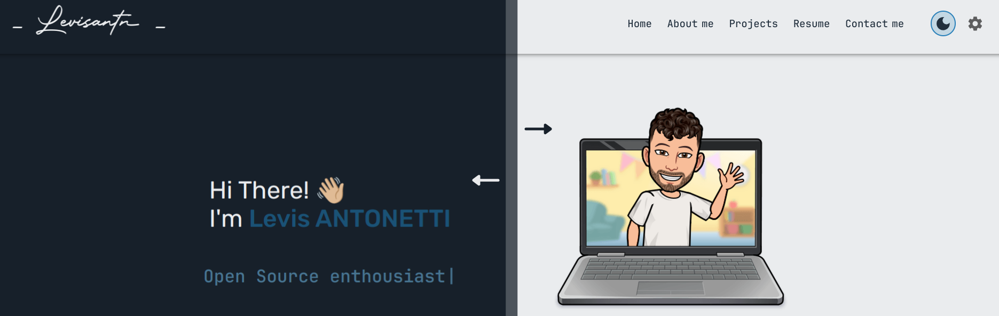

# My portofolio Website



---

       


**Explore my Portofolio website and learn more about my skills and experiences. This website showcases some of my work and projects. Feel free to scroll it and discover more!**

## Build With

This Website use [Create React App](https://create-react-app.dev/docs/getting-started) template, a single page React application that load a single html file and JavaScript loads the entire UI including routes.

This template provides a minimal setup to get React working in Vite with HMR and some ESLint rules. This project use the official plugins available: [@vitejs/plugin-react](https://github.com/vitejs/vite-plugin-react/blob/main/packages/plugin-react/README.md) that uses [Babel](https://babeljs.io/) for Fast Refresh.

The project is built using [React](https://react.dev/) for the frontend framework, [Material UI](https://mui.com/material-ui/all-components/) for a consistent and customizable UI, [React Router](https://reactrouter.com/) for efficient navigation, and [npm](https://www.npmjs.com/) for package management.

## Installation & setup

Clone down this repository. You will need node.js and git installed globally on your machine.

```sh
# 1. Install the dependencies
npm install # in the root directory of the project

# 2. run the website in localhost
npm run dev

# do some changes

# 3. build the project
npm run build

# 4. deploy the project
TODO
```

## Tools used

### debugging

- [react dev tool](https://react.dev/learn/react-developer-tools)

### linting, formatting

- [eslint](https://eslint.org/)
- [prettier](https://prettier.io/) / [eslint-config-prettier](https://github.com/prettier/eslint-config-prettier)
- [husky](https://github.com/typicode/husky) with [lint-staged](https://github.com/lint-staged/lint-staged?tab=readme-ov-file)

### theme & colors & fonts

- [color codes](https://htmlcolorcodes.com/)
- [mui theme creator](https://bareynol.github.io/mui-theme-creator/)
- [cssgradient.io](https://cssgradient.io/)

### fonts

- [google fonts](https://fonts.google.com/)
- [font squirrel](https://www.fontsquirrel.com/tools/webfont-generator)
- [font space](https://www.fontspace.com/)

### icons

- [font awesome](https://docs.fontawesome.com/web)
- [material icons](https://mui.com/material-ui/material-icons/)

### illustrations

[bitmoji](https://www.bitmoji.com/)

## License

[MIT](LICENSE)

## Inspirations

- [ashutosh1919 masterPortfolio](https://github.com/ashutosh1919/masterPortfolio)
- [mldangelo personal-site](https://github.com/mldangelo/personal-site)
- [arifszn gitprofile](https://github.com/arifszn/gitprofile)
- [soumyajit4419 Portfolio](https://github.com/soumyajit4419/Portfolio)
- [devhints](https://github.com/rstacruz/cheatsheets)
